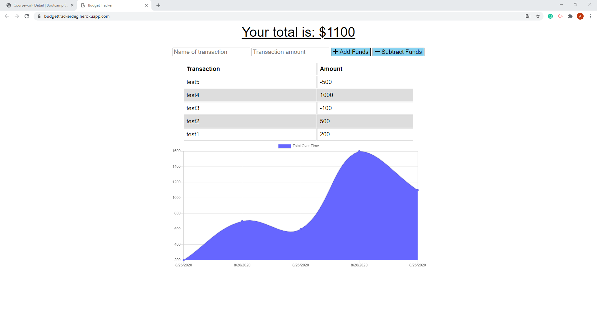

# Online/Offline Budget Trackers

- Link to
  [Heroku ](https://budgettrackerdeg.herokuapp.com/)
  and
  [GitHub ](https://github.com/DEG18/Progressive-Budget)

### Table of Contents

1. [Description](#description)
2. [Usage](#usage)
4. [License](#license)
5. [Contributing](#contributing)
6. [Questions](#questions)

### Description

- This app allows users to use the accounting function normally without internet.

- In the case of network recovery, all data will be automatically updated to the forefront.

- This solves the problem that users cannot use the app normally without a network, and improves user experience.

### Usage

- After users enter the webpage, they will be able to record the name and amount of each transaction, and they can click on "Add Fund" or "Subtract Fund" for accounting.

### License

- MIT

### Contributing

- Luyu Zeng

### Questions
##### Email:
- zengluyu252@gmail.com

### Screen Shots

